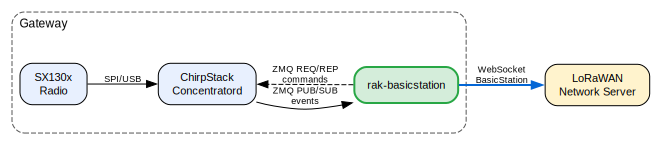
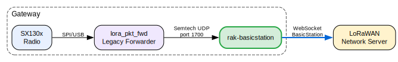
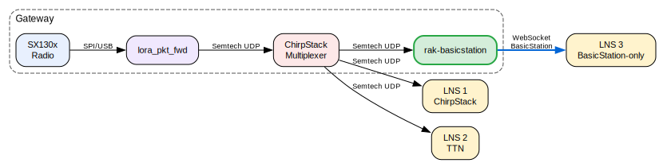
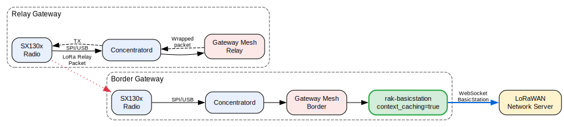

# RAK BasicStation Forwarder

A LoRaWAN packet forwarder that implements the [LoRa Basics Station](https://doc.sm.tc/station/) protocol. It supports two backends for receiving uplink frames and sending downlinks:

- **ChirpStack Concentratord** (ZMQ IPC) - communicates with concentratord for SX130x hardware access.
- **Semtech UDP Packet Forwarder** - acts as a UDP server for any standard Semtech UDP packet forwarder (`lora_pkt_fwd` or compatible).

## What It Does

This is a Rust implementation of the [LoRa Basics Station](https://github.com/lorabasics/basicstation) protocol that bridges gateway hardware (via either backend) with LoRaWAN Network Servers using the BasicStation LNS/CUPS protocols.

```text
┌──────────────────────────────────────────────────────────┐
│                     rak-basicstation                     │
│                                                          │
│  ┌──────────────┐  ┌──────────────┐  ┌─────┐  ┌───────┐  │
│  │Concentratord │  │  Semtech UDP │  │ LNS │  │ CUPS  │  │
│  │Backend (ZMQ) │  │Backend (UDP) │  │(WSS)│  │(HTTPS)│  │
│  └──────┬───────┘  └──────┬───────┘  └──┬──┘  └──┬────┘  │
│         │                 │             │        │       │
│         └────────┬────────┘    ┌────────┴───┐    │       │
│                  │             │  Protocol  │    │       │
│                  └─────────────┤  Bridge    ├────┘       │
│                                │(proto↔JSON)│            │
│                                └────────────┘            │
└──────────┬──────────┬──────────────┬─────────────┬───────┘
           ▼          ▼              ▼             ▼
    Concentratord  Semtech UDP   LoRaWAN LNS   CUPS Server
     (ZMQ IPC)    Pkt Forwarder  (WebSocket)    (HTTPS)
```

## Features

- **LNS Protocol (v2)**: WebSocket-based communication with LoRaWAN Network Servers
  - Router discovery (`/router-info`)
  - Uplink forwarding (`jreq`, `updf`, `propdf`)
  - Downlink handling (`dnmsg`, `dnsched`) for Class A, B, and C
  - Downlink TX confirmation (`dntxed`)
  - Time synchronization
  - Dynamic channel plan configuration via `router_config`
- **CUPS Protocol**: HTTPS-based credential and configuration management
  - Periodic update checks with configurable intervals
  - Credential persistence and CRC32 tracking
  - URI and credential updates from server
- **Authentication**: TLS server auth, mutual TLS, and token-based auth
- **CRC filtering**: Configurable forwarding of ok/invalid/missing CRC frames
- **Dual backend**: ChirpStack Concentratord (ZMQ) or Semtech UDP Packet Forwarder, selectable via config
- **Context caching** (concentratord): optionally caches the full `rx_info.context` blob on uplink and restores it verbatim on the matching downlink

## Compatible With

- [The Things Network](https://www.thethingsnetwork.org/) (TTN/TTI)
- [ChirpStack](https://www.chirpstack.io/) (with BasicStation support)
- [AWS IoT Core for LoRaWAN](https://docs.aws.amazon.com/iot/latest/developerguide/connect-iot-lorawan.html)
- Any LNS implementing the BasicStation protocol

## Requirements

- A gateway backend (one of):
  - [ChirpStack Concentratord](https://github.com/chirpstack/chirpstack-concentratord) running and configured for your gateway hardware
  - A Semtech UDP Packet Forwarder (`lora_pkt_fwd` or compatible) sending to the configured UDP bind address
- A LoRaWAN Network Server with BasicStation/LNS protocol support

## Building

### Prerequisites

- Rust 1.89+ (automatically managed via `rust-toolchain.toml`)
- protobuf compiler (`protoc`) with well-known types:
  - Fedora/RHEL: `sudo dnf install protobuf-devel`
  - Debian/Ubuntu: `sudo apt install protobuf-compiler libprotobuf-dev`
- ZeroMQ development libraries — only needed for the `concentratord` feature:
  - Fedora/RHEL: `sudo dnf install zeromq-devel`
  - Debian/Ubuntu: `sudo apt install libzmq3-dev`

### Build

```sh
# Both backends (default)
cargo build --release

# Only Semtech UDP backend (no ZMQ dependency)
cargo build --release --no-default-features --features semtech_udp

# Only Concentratord backend
cargo build --release --no-default-features --features concentratord
```

### Cross-compilation

Cross-compilation for embedded targets uses the `cross` tool. A specific pinned revision is
required — use the Makefile target to install it locally:

```sh
# Install the pinned cross version into .cargo/bin/ (once)
make dev-dependencies

# Build for all targets
make build

# Build for a specific target
make build-aarch64-unknown-linux-musl
```

Supported targets:
- `x86_64-unknown-linux-musl` (AMD64)
- `aarch64-unknown-linux-musl` (ARM64, e.g. Raspberry Pi 4)
- `armv7-unknown-linux-musleabihf` (ARM32 hard-float)
- `armv5te-unknown-linux-musleabi` (ARM v5)
- `mipsel-unknown-linux-musl` (MIPS little-endian, RAK OpenWrt gateways)

> **Note:** MIPSEL is a Rust tier-3 target and requires a nightly toolchain.
> Both backends are built by default; `zmq-sys` compiles `libzmq` from its bundled source
> via cmake, so no pre-installed system library is needed. Use the Makefile target
> `build-mipsel-unknown-linux-musl`, which handles the required
> `cross +nightly-2026-01-27 -Z build-std=panic_abort,std` flags automatically.

### Tests

```sh
cargo test
cargo clippy --no-deps
```

## Configuration

Configuration is via TOML file. Generate a template:

```sh
rak-basicstation configfile
```

Pass one or more config files at startup:

```sh
rak-basicstation -c /etc/rak-basicstation/rak-basicstation.toml
```

### Example Configuration (Concentratord backend)

```toml
[logging]
  level = "info"
  log_to_syslog = false

[backend]
  enabled = "concentratord"

  [backend.filters]
    forward_crc_ok = true
    forward_crc_invalid = false
    forward_crc_missing = false

  [backend.concentratord]
    event_url = "ipc:///tmp/concentratord_event"
    command_url = "ipc:///tmp/concentratord_command"
    # context_caching = false  # Set to true when using chirpstack-gateway-mesh

[lns]
  server = "wss://lns.example.com:8887"
  reconnect_interval = "5s"
  ca_cert="..."
  tls_cert="..."
  tls_key="..."

[cups]
  enabled = false
```

### Example Configuration (Semtech UDP backend)

```toml
[logging]
  level = "info"
  log_to_syslog = false

[backend]
  enabled = "semtech_udp"
  # gateway_id = ""  # Optional; auto-discovered from first PULL_DATA if empty

  [backend.filters]
    forward_crc_ok = true
    forward_crc_invalid = false
    forward_crc_missing = false

  [backend.semtech_udp]
    bind = "0.0.0.0:1700"
    time_fallback_enabled = false

[lns]
  server = "wss://lns.example.com:8887"
  reconnect_interval = "5s"
  ca_cert="..."
  tls_cert="..."
  tls_key="..."

[cups]
  enabled = false
```

Environment variables can be substituted in the config file using `${VAR_NAME}` syntax.

### Authentication Modes

| Mode | `ca_cert` | `tls_cert` | `tls_key` | Description |
|------|-----------|------------|-----------|-------------|
| No Auth | - | - | - | Plain WS/HTTP (development only) |
| Server Auth | CA cert | - | - | TLS, server verified |
| Mutual TLS | CA cert | Client cert | Client key | Both sides verified |
| Token Auth | CA cert | - | Auth token file | TLS + Authorization header |

## Testing

Example utilities for testing without real hardware are in `examples/`. See [`examples/README.md`](examples/README.md) for details:

- **`fake_concentratord`** — simulates the Concentratord ZMQ API (publishes uplinks, handles commands)
- **`load_test`** — end-to-end load test (fake backend + fake LNS) with throughput and latency reporting

## Docker

A `docker-compose.yml` is provided for running rak-basicstation alongside ChirpStack Concentratord. Configuration is done via environment variables, which are substituted into the TOML config template at startup using `${VAR_NAME}` syntax. All variables have sensible defaults set by the entrypoint script, so only the ones you need to change must be specified.

### Environment Variables

| Variable | Description | Default |
|---|---|---|
| `BACKEND_ENABLED` | Backend to use: `concentratord` or `semtech_udp` | `concentratord` |
| `BACKEND_GATEWAY_ID` | Gateway EUI-64 identifier (leave empty for auto-discovery) | _(empty)_ |
| `CONCENTRATORD_EVENT_URL` | ZMQ IPC URL for Concentratord event socket | `ipc:///tmp/concentratord_event` |
| `CONCENTRATORD_COMMAND_URL` | ZMQ IPC URL for Concentratord command socket | `ipc:///tmp/concentratord_command` |
| `CONCENTRATORD_CONTEXT_CACHING` | Cache full `rx_info.context` on uplink and restore it on the matching downlink (concentratord backend only; required for Gateway Mesh) | `false` |
| `SEMTECH_UDP_BIND` | UDP bind address for the Semtech UDP backend | `0.0.0.0:1700` |
| `LNS_SERVER` | LNS WebSocket server URI | `wss://localhost:8887` |
| `LNS_RECONNECT_INTERVAL` | Reconnect interval after LNS disconnection | `5s` |
| `CUPS_ENABLED` | Enable the CUPS update client | `false` |
| `CUPS_SERVER` | CUPS server URL | _(empty)_ |
| `LOG_LEVEL` | Logging level: `TRACE`, `DEBUG`, `INFO`, `WARN`, `ERROR`, `OFF` | `info` |

### TLS Certificates

Mount your TLS certificates and keys to `/etc/rak-basicstation/certs/` (read-only):

| File | Purpose |
|---|---|
| `tc.trust` | CA certificate for LNS server verification |
| `tc.cert` | Client certificate for LNS mutual TLS |
| `tc.key` | Client key or auth token for LNS |
| `cups.trust` | CA certificate for CUPS server verification |
| `cups.cert` | Client certificate for CUPS mutual TLS |
| `cups.key` | Client key or auth token for CUPS |

### Quick Start

```sh
# Set your LNS server and start
LNS_SERVER=wss://lns.example.com:8887 docker compose up -d
```

### Publishing Multi-arch Images to Docker Hub

The provided GitHub Actions workflow (`.github/workflows/release.yml`) builds and pushes a
multi-arch manifest covering `linux/amd64`, `linux/arm64`, and `linux/arm/v7` on every
`v*` tag push.

**How it works:**

1. The three target binaries are cross-compiled with `cross` (native cross-compilation — no QEMU):
   - `x86_64-unknown-linux-musl` → `linux/amd64`
   - `aarch64-unknown-linux-musl` → `linux/arm64`
   - `armv7-unknown-linux-musleabihf` → `linux/arm/v7`
2. Binaries are staged under `dist/` with names matching Docker's `TARGETARCH`+`TARGETVARIANT` pattern (`dist/rak-basicstation-amd64`, `dist/rak-basicstation-arm64`, `dist/rak-basicstation-armv7`).
3. `docker buildx` assembles the multi-arch manifest using `Dockerfile.release`, which simply copies the right binary — no compilation happens inside Docker.

Because the musl binaries are fully statically linked (ZMQ is bundled by `zmq-sys`), the
runtime image only requires `ca-certificates` and has no `libzmq` dependency.

**Required repository secrets:**

| Secret | Description |
|---|---|
| `DOCKERHUB_USERNAME` | Docker Hub account username |
| `DOCKERHUB_TOKEN` | Docker Hub [access token](https://docs.docker.com/security/for-developers/access-tokens/) (not your password) |

**To trigger a release:**

```sh
git tag v1.2.3
git push origin v1.2.3
```

The workflow produces tags `1.2.3`, `1.2`, and `latest` on Docker Hub.

**To build and push manually:**

```sh
# Install the pinned cross version (once)
make dev-dependencies

# Cross-compile and stage the binaries
make build-x86_64-unknown-linux-musl
make build-aarch64-unknown-linux-musl
make build-armv7-unknown-linux-musleabihf
mkdir -p dist
cp target/x86_64-unknown-linux-musl/release/rak-basicstation  dist/rak-basicstation-amd64
cp target/aarch64-unknown-linux-musl/release/rak-basicstation  dist/rak-basicstation-arm64
cp target/armv7-unknown-linux-musleabihf/release/rak-basicstation dist/rak-basicstation-armv7

# Build and push the multi-arch image
docker buildx build -f Dockerfile.release \
  --platform linux/amd64,linux/arm64,linux/arm/v7 \
  --push -t yourname/rak-basicstation:latest .
```

## Project Structure

```
src/
├── main.rs                 # Entry point, CLI, signal handling
├── lib.rs                  # Module declarations
├── config.rs               # TOML configuration structures
├── logging.rs              # stdout/syslog setup
├── metadata.rs             # Gateway metadata collection
├── backend/
│   ├── mod.rs              # Backend trait, dispatch, and setup
│   ├── concentratord.rs    # ZMQ event/command sockets
│   └── semtech_udp/
│       ├── mod.rs          # UDP server, protocol handling
│       └── structs.rs      # Semtech UDP v2 protocol structs
├── lns/
│   ├── mod.rs              # LNS connection loop
│   ├── discovery.rs        # Router discovery (/router-info)
│   ├── websocket.rs        # WebSocket client
│   ├── messages.rs         # JSON message types (serde)
│   ├── router_config.rs    # Channel plan translation
│   ├── uplink.rs           # Uplink frame conversion
│   ├── downlink.rs         # Downlink frame conversion
│   └── timesync.rs         # Time synchronization
├── cups/
│   ├── mod.rs              # CUPS update loop
│   ├── client.rs           # HTTPS client and response parser
│   └── credentials.rs      # Credential management
└── cmd/
    ├── mod.rs
    └── configfile.rs        # Config template generator
examples/
├── fake_concentratord.rs   # Fake Concentratord for functional testing
└── load_test.rs            # End-to-end load test (fake backend + fake LNS)
openwrt/
├── rak-basicstation/           # OpenWrt package (binary + init + UCI config)
│   ├── Makefile
│   └── files/
│       ├── rak-basicstation.init    # procd init script
│       ├── rak-basicstation.sh      # UCI → TOML config generator
│       └── rak-basicstation.config  # Default UCI config
└── luci-app-rak-basicstation/  # LuCI web UI package
    ├── Makefile
    ├── htdocs/luci-static/resources/view/rak/rak-basicstation.js
    └── root/usr/share/luci/menu.d/luci-app-rak-basicstation.json
```

## OpenWrt Package

Two OpenWrt packages are provided in the `openwrt/` directory for integration into the OpenWrt build system:

| Package | Description |
|---|---|
| `rak-basicstation` | Binary, procd init script, UCI→TOML config generator shell library, and default UCI config |
| `luci-app-rak-basicstation` | LuCI web UI with tabbed forms for Backend, LNS, and CUPS settings |

To add these packages to an OpenWrt build:

```sh
# Add openwrt/ sub-directories as a local feed in feeds.conf, then:
./scripts/feeds update -a && ./scripts/feeds install rak-basicstation luci-app-rak-basicstation
make package/rak-basicstation/compile
make package/luci-app-rak-basicstation/compile
```

**Configuration on the device:**

UCI configuration is stored in `/etc/config/rak-basicstation`. On each service start or reload the init script calls `rak-basicstation.sh`, which:

1. Writes any certificate/key PEM content from UCI options to files under `/var/etc/rak-basicstation/`.
2. Generates a TOML config at `/var/etc/rak-basicstation/rak-basicstation.toml`.
3. Passes that TOML file to the binary via `-c`.

The LuCI app (`luci-app-rak-basicstation`) provides a web UI under **RAK → BasicStation Forwarder** with tabs for Backend (concentratord slot, context caching), LNS (server URI, certificates), and CUPS settings.

## Security Considerations

- **Credential file permissions**: CUPS-persisted credentials (private keys, tokens) are written with mode `0600`. Ensure the configuration and credentials directories are only readable by the service user.
- **Semtech UDP trust model**: The UDP backend accepts packets from any local sender. It is designed for co-located processes on the same host. Do not expose the UDP bind port to untrusted networks.
- **OpenWrt UCI input**: UCI values are escaped before TOML interpolation, but operators should avoid setting configuration via untrusted input sources.
- **TLS authentication**: Production deployments should use mutual TLS or token-based auth. Plain WebSocket (`ws://`) should only be used for development.
- **LNS discovery**: The `lns.server` field is used as the initial endpoint for router discovery (`/router-info`). The actual WebSocket connection target (MUXS URI) is returned by the discovery response. If `lns.discovery_endpoint` is set, it overrides the discovery URL.

## Topologies

### 1. ChirpStack BasicStation Gateway

The standard deployment for ChirpStack-based gateways. Concentratord handles the SX130x
radio hardware and exposes uplinks/commands over ZMQ. rak-basicstation subscribes to
uplinks, converts them to BasicStation JSON, and forwards them to the LNS over WebSocket.
Downlinks travel the reverse path.



### 2. Legacy-to-BasicStation Bridge

Converts a legacy Semtech UDP packet forwarder into a BasicStation-compatible gateway.
rak-basicstation acts as a UDP server on port 1700, receiving PUSH_DATA/PULL_DATA from
the existing packet forwarder and translating them to the BasicStation WebSocket protocol.
This allows migrating to a BasicStation-based LNS without replacing the gateway firmware.



### 3. Multiplexer (Multi-LNS Fan-Out)

Uses [ChirpStack Gateway Mesh Multiplexer](https://github.com/chirpstack/chirpstack-multiplexer)
to fan out uplinks from a single packet forwarder to multiple destinations. Each destination
can be a different LNS using the Semtech UDP protocol, while rak-basicstation serves as one
of the targets to reach a BasicStation-only LNS. This is useful for forwarding traffic to
multiple network servers simultaneously (e.g., a private ChirpStack instance and TTN).



### 4. Gateway Mesh

In a [ChirpStack Gateway Mesh](https://github.com/chirpstack/chirpstack-gateway-mesh)
deployment, remote gateways relay uplinks to a border gateway via LoRa concentrator-to-concentrator
communication. The border gateway runs Gateway Mesh between Concentratord and
rak-basicstation, which forwards the aggregated traffic to the LNS. Requires
`context_caching = true` so that the full `rx_info.context` blob (carrying mesh relay
metadata) is preserved through the uplink/downlink round-trip.



## License

MIT

## Related Projects

- [ChirpStack Concentratord](https://github.com/chirpstack/chirpstack-concentratord) - Hardware abstraction daemon for SX130x chips
- [ChirpStack MQTT Forwarder](https://github.com/chirpstack/chirpstack-mqtt-forwarder) - MQTT-based forwarder (architecture reference)
- [LoRa Basics Station](https://github.com/lorabasics/basicstation) - Original BasicStation implementation (protocol reference)
